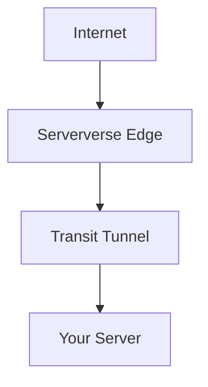

Serververse™ Network Transit uses tunneling to securely route traffic between your server and the Serververse edge network.

## Architecture Overview



<Tabs>
  <Tab title="WireGuard">
    ## WireGuard Setup

    WireGuard is the current transport layer used for establishing secure tunnels.

    <Steps>
      <Step title="Run Installer">
        Run the installer on your server:

        ```bash
        bash <(curl -fsSL https://transit.serververs.com/transit.sh)
        ```
      </Step>
      <Step title="Generate Configuration">
        The script will:

        - Install required packages
        - Generate keys
        - Create tunnel configuration
      </Step>
      <Step title="Submit Public Key">
        After installation, copy your **Client Public Key** and send it to the Serververse™ Support Team.
      </Step>
      <Step title="Wait for Provisioning">
        The Serververse network will configure your tunnel and attach your public IP.
      </Step>
      <Step title="Start Tunnel">
        Once confirmed, start your tunnel:

        ```bash
        wg-quick up wg0 && systemctl enable wg-quick@wg0
        ```
      </Step>
    </Steps>

    ### Verification

    Check if the tunnel is active:

    ```bash
    wg show
    ip a
    ```
  </Tab>
  <Tab title="GRE (Coming Soon)">
    ## GRE Tunneling

    GRE (Generic Routing Encapsulation) support is currently under development.

    ### For Whom?

    - GRE-based tunnels will allow **lower overhead routing**
    - Designed for advanced networking setups
    - Ideal for high-performance and custom routing use cases

    ### Coming Soon

    GRE support will include:

    - Automated configuration
    - Multi-IP routing
    - Advanced control over traffic flow
  </Tab>
</Tabs>

<Warning>
  Always ensure **backup access (IPMI / VNC / Console)** before configuring tunnels\
  Incorrect setup may temporarily disrupt SSH connectivity\
  Do not start the tunnel before provisioning is completed
</Warning>